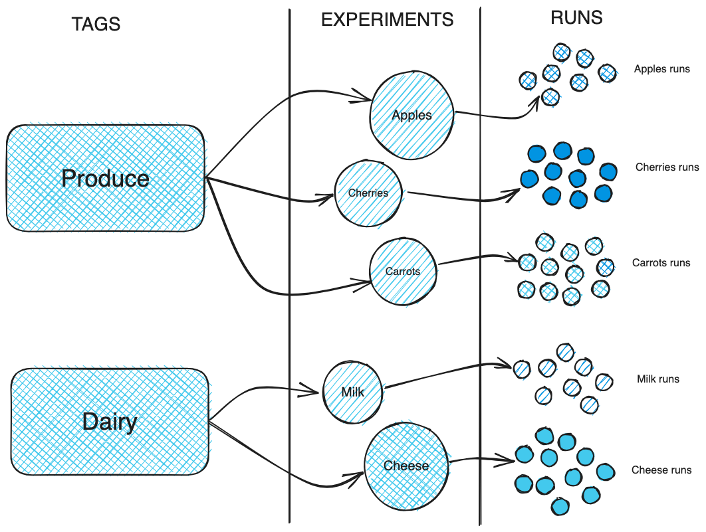
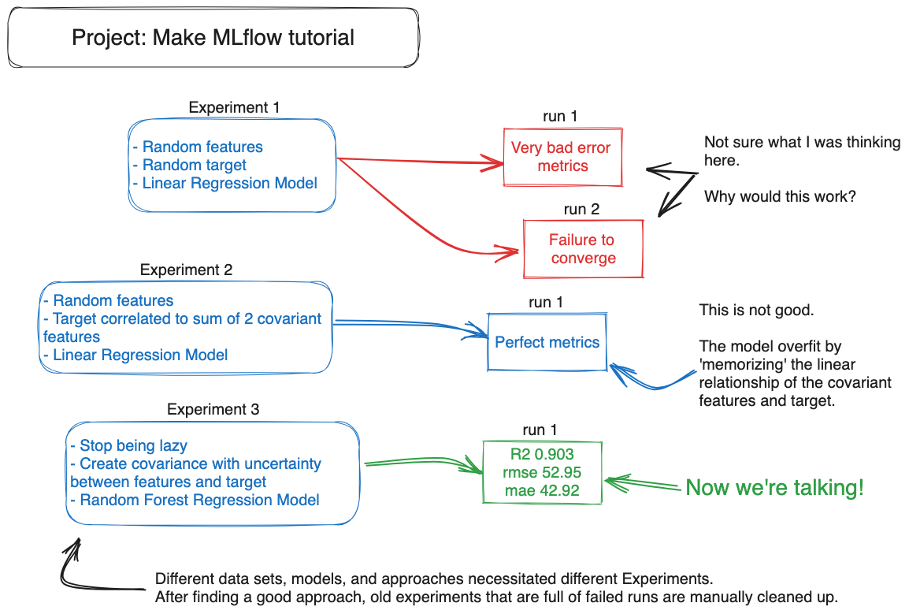

# mlflow-tutorial
[MLflow Tutorial](https://mlflow.org/docs/latest/getting-started/logging-first-model/index.html) 수행

## Tracking Server
### Setup
1. `pip install mlflow`
2. `mlflow server --host 127.0.0.1 --port 8080`
### UI
#### Experiments
- 모델 학습, 검증에 대한 메트릭을 분석하여 적합한 모델, 데이터 형식을 선택하기 위해 사용
- Classic ML, LLM 모두 분석할 수 있다
#### Models
> 모델 메타 데이터에 모델을 연결하려면 별도 작업을 수행해야 한다.
- Model Registry 관리
- 모델 메타데이터 생성, 태깅, 버전 관리
- Experiments의 결과로 만들어진 Model Artifact를 Models의 메타 데이터와 연동하여 관리한다.

## Client API
- 모델 학습을 위해 사용하는 주요 기능
- Tracking Server로 시각화 가능

### Default Experiment
- 실험을 명시적으로 정의하지 않고 수행한 경우, 선택되는 실험
- 실험에 대한 모든 정보를 담고 있다.
- Tracking data가 소실되는 것을 방지하기 위해 존재하는 매커니즘

### Metadata
- Client API에서 반환하는 대부분의 값은 Task 수행과 관련된 메타 데이터를 포함한다.
- Ex. `search_experiments() -> PagedList[Experiment]`
  ```python
  class Experiment(_MlflowObject):
    DEFAULT_EXPERIMENT_NAME = "Default"
    def __init__(
        self,
        experiment_id,
        name,
        artifact_location,
        lifecycle_stage,
        tags=None,
        creation_time=None,
        last_update_time=None,
    ):
        ...
  ```

## Creating Experiments
### Tags vs Experiments
#### Unique Experiment
- Enhanced Organization: 각 Experiment를 독립함으로써 보다 수월하게 관리할 수 있다.
- Metadata Annotation: Metadata는 Experiment 단위로 관리된다.
- Experiments는 Input Dataset/Model에 따라 구분한다.
#### Tag
- Experiments를 그룹으로 관리할 필요가 있을 때 Tag를 사용한다.
#### Example


- Project: 각 상품별 수요 예측
- Tag: 식자재 체인점의 각 지점(Produce, Dairy)
- Experiments: 각 상품
- Runs: 상품에 대한 테스트


## Running
> 프로젝트의 초기부터 다양한 실험을 함으로써 모델을 지속적으로 테스트해야 한다.




Experiment는 다음 상황에서 새롭게 만들어져야 한다.
1. 입력 데이터 형식이 변했을 때
2. 사용하는 모델이 변했을 때

### Traning
```python
metrics = {"mae": mae, "mse": mse, "rmse": rmse, "r2": r2}
with mlflow.start_run(run_name=run_name) as run:
    # 7-1. Model Parameter 저장
    mlflow.log_params(params)
    # 7-2. Metrics 저장
    mlflow.log_metrics(metrics)
    # 7-3. 학습된 모델 저장
    mlflow.sklearn.log_model(
        sk_model=rf, input_example=X_val, artifact_path=artifact_path
    )
```
- Experiment에 대한 실행 종료 후, 학습된 모델을 Registry에 저장하여 재사용할 수 있다.
- Registry의 기본 위치는 `mlartifacts`이다.
- Artifact에 대한 Model Meta Data 관리를 위해 Models를 사용할 수 있고, 이때 버전 관리 등의 작업이 이루어진다.
- Model Registry는 Artifact + Meta data 관리를 위해 사용하는 것이다.

> Model Registry에 Artifact를 등록하지 않는다면 해당 모델을 재사용하기 어렵다
